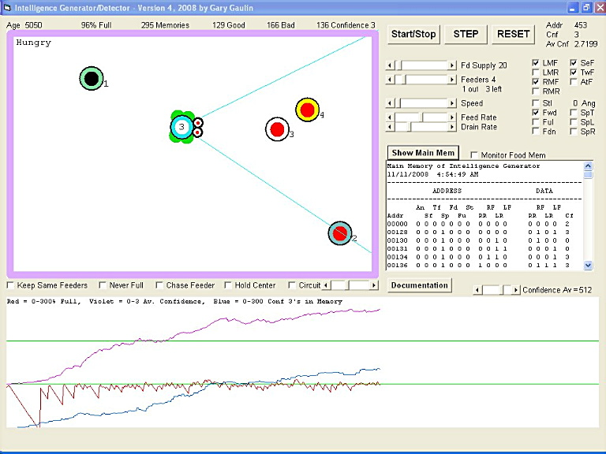



## Intelligence Generator/Detector, Version 4\.0

### Description

This computer model demonstrates self-organizing, self-learning intelligence. On startup this guess/memory intelligence is like a newborn. It does not know up from down or left from right or what it&#8217;s seeing, experiencing. But from trial and error quickly learns how to coordinate motors with sensory information to get where it wants to go.

The model also has an angular ring memory that adds awareness of where the feeder is located when it is out of its field of vision. Like us when a ball goes by we know where it went and without thinking about it can turn in the proper direction. This can be tested by checking a box that allows the mouse to be used to move the feeder around the screen so it gives chase. After some training time it will get very good at keeping up with it.

This model is analogous to finger muscle control that through training becomes coordinated in a way that they have the keyboard layout stored as motions to reach each key. In both cases intelligence successfully learns to navigate a 3D space without requiring a physical map.

Intelligence detection is in the form of a graphic display that allows confidence, contents of memory and success staying fed to be shown. No intelligence at all would produce a flat-line graph. But as input sensory information is added it's learning rate increases, as does its confidence level. Experimenting with how the simple main loop uses its sensory information (analogous to how neurons are connected) can produce thousands of various behaviors.

Documentation Included.
 
### More Info
 

             |
---                |---
**Submitted On**   |2008-11-11 06:16:02
**By**             |[Gary Gaulin](https://github.com/Planet-Source-Code/PSCIndex/blob/master/ByAuthor/gary-gaulin.md)
**Level**          |Intermediate
**User Rating**    |5.0 (20 globes from 4 users)
**Compatibility**  |VB 6\.0
**Category**       |[Games](https://github.com/Planet-Source-Code/PSCIndex/blob/master/ByCategory/games__1-38.md)
**World**          |[Visual Basic](https://github.com/Planet-Source-Code/PSCIndex/blob/master/ByWorld/visual-basic.md)
**Archive File**   |[Intelligen21337511112008\.zip](https://github.com/Planet-Source-Code/gary-gaulin-intelligence-generator-detector-version-4-0__1-71381/archive/master.zip)

